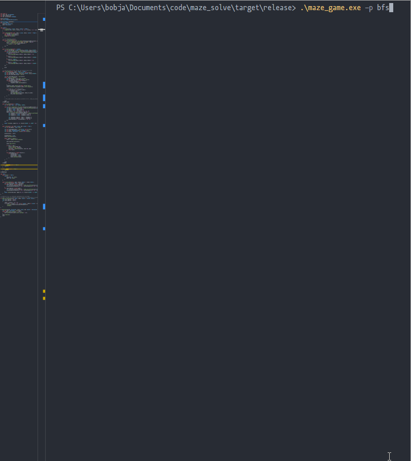

# Maze Game
---
A small terminal-based maze game with pathfinding visualisations.

### How to Play
```
Use arrow keys (← ↑ ↓ →) to move around
Get to the goal (bottom right, highlighted with green).
```

### Pathfinding algorithms
These are all basically translated code from wikipedia and stackoverflow. Use the `-p` flag with the name of the pathfinding algorithm to display the pathfinding visualisation. You can find the available pathfinding algorithms with `--help`.

### Help Command
```
A small maze game with a pathfinding visualisation

Usage: maze_game.exe [OPTIONS]

Options:
  -p, --pathfind <path>  Enables a pathfinding algorithm,
                         choose from (bfs, djikstra, a*) [default: ]
  -h, --help             Print help
  -V, --version          Print version
```

## Building
Require `cargo` and just use the command `cargo build --release` to build the program. Run in the command-line just like any other program (`./maze_game.exe`, `./maze_game`, etc.)

# Gallery
